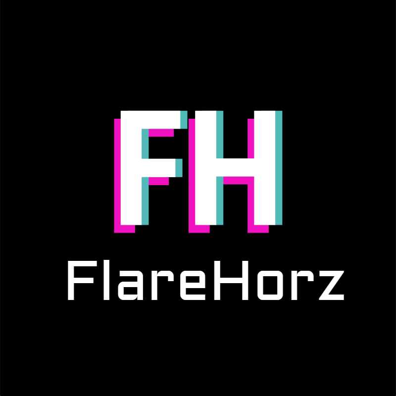

<!-- Improved compatibility of back to top link: See: https://github.com/othneildrew/Best-README-Template/pull/73 -->
<a id="readme-top"></a>
<!--
[CHANGELOG.md](CHANGELOG.md)
-->


<!-- PROJECT SHIELDS -->
[![Contributors][contributors-shield]][contributors-url]
[![Forks][forks-shield]][forks-url]
[![Stargazers][stars-shield]][stars-url]
[![Issues][issues-shield]][issues-url]
[![project_license][license-shield]][license-url]


<!-- PROJECT LOGO -->
<br />
<div align="center">
  <a href="https://github.com/fnaxi/FlareHorz">
    
  </a>

<h3 align="center">FlareHorz Engine</h3>

  <p align="center">
    Powerful 2D game engine
    <br />
    <a href="https://github.com/fnaxi/FlareHorz/Docs.md"><strong>Explore the docs »</strong></a>
    <br />
    <br />
    <a href="https://github.com/fnaxi/FlareHorz">View Demo</a>
    &middot;
    <a href="https://github.com/fnaxi/FlareHorz/issues/new?labels=bug&template=bug-report---.md">Report Bug</a>
    &middot;
    <a href="https://github.com/fnaxi/FlareHorz/issues/new?labels=enhancement&template=feature-request---.md">Request Feature</a>
  </p>
</div>


<!-- TABLE OF CONTENTS -->
<details>
  <summary>Table of Contents</summary>
  <ol>
    <li>
      <a href="#about-the-project">About The Project</a>
    </li>
    <li>
      <a href="#getting-started">Getting Started</a>
      <ul>
        <li><a href="#installation">Installation</a></li>
      </ul>
    </li>
    <li><a href="#usage">Usage</a></li>
    <li><a href="#roadmap">Roadmap</a></li>
    <li><a href="#contributing">Contributing</a></li>
    <li><a href="#license">License</a></li>
  </ol>
</details>


<!-- ABOUT THE PROJECT -->
## About The Project

[![Product Name Screen Shot][product-screenshot]](https://github.com/fnaxi/FlareHorz.git)

<p align="right">(<a href="#readme-top">back to top</a>)</p>

<!-- GETTING STARTED -->
## Getting Started

### Installation

1. Clone the repo
	```sh
	git clone https://github.com/fnaxi/FlareHorz.git
	```
2. Run GenerateMinimalSolution.bat
	```sh
	GenerateMinimalSolution.bat
	```
3. Open `FlareHorz.sln` and run **FlareBuildTool** project, it will generate new `FlareHorz.sln` and you will see all projects in the solution.


<p align="right">(<a href="#readme-top">back to top</a>)</p>


<!-- USAGE EXAMPLES -->
## Usage

Use this space to show useful examples of how a project can be used. Additional screenshots, code examples and demos work well in this space. You may also link to more resources.

_For more examples, please refer to the [Documentation](https://github.com/fnaxi/FlareHorz/Docs.md)_

<p align="right">(<a href="#readme-top">back to top</a>)</p>


<!-- ROADMAP -->
## Roadmap

#####  FLARE CORE
- [ ] **WIP |** Parse command line args with attribute

##### FLARE BUILD TOOL
- [ ] **WIP |** Modules
- [ ] ThirdParty/ targets
- [ ] Subgroups for targets

##### FLARE HEADER TOOL
- [ ] Base API

##### FLARE ENGINE
- [ ] Base API

See the [open issues](https://github.com/fnaxi/FlareHorz/issues) for a full list of proposed features (and known issues) and our [Trello Board](https://trello.com/b/aVJsrcHb) to see on what we're working right now.

<p align="right">(<a href="#readme-top">back to top</a>)</p>


<!-- CONTRIBUTING -->
## Contributing

We welcome ***contributions***!

You can check for any TODO comments in the code. These highlight areas where contributions are needed or improvements can be made.
By working on these TODOs, you can help us prioritize the most pressing needs in the project.

1. Fork the Project
2. Create your Feature Branch (`git checkout -b feature/AmazingFeature`)
3. Commit your Changes (`git commit -m 'Add some AmazingFeature'`)
4. Push to the Branch (`git push origin feature/AmazingFeature`)
5. Open a Pull Request

<p align="right">(<a href="#readme-top">back to top</a>)</p>

### Top contributors:

<a href="https://github.com/fnaxi/FlareHorz/graphs/contributors">
  
</a>


<!-- LICENSE -->
## License

Distributed under the project_license. See `LICENSE.txt` for more information.

<p align="right">(<a href="#readme-top">back to top</a>)</p>

<!-- MARKDOWN LINKS & IMAGES -->
<!-- https://www.markdownguide.org/basic-syntax/#reference-style-links -->
[contributors-shield]: https://img.shields.io/github/contributors/fnaxi/FlareHorz.svg?style=for-the-badge
[contributors-url]: https://github.com/fnaxi/FlareHorz/graphs/contributors
[forks-shield]: https://img.shields.io/github/forks/fnaxi/FlareHorz.svg?style=for-the-badge
[forks-url]: https://github.com/fnaxi/FlareHorz/network/members
[stars-shield]: https://img.shields.io/github/stars/fnaxi/FlareHorz.svg?style=for-the-badge
[stars-url]: https://github.com/fnaxi/FlareHorz/stargazers
[issues-shield]: https://img.shields.io/github/issues/fnaxi/FlareHorz.svg?style=for-the-badge
[issues-url]: https://github.com/fnaxi/FlareHorz/issues
[license-shield]: https://img.shields.io/github/license/fnaxi/FlareHorz.svg?style=for-the-badge
[license-url]: https://github.com/fnaxi/FlareHorz/blob/master/LICENSE.txt
[linkedin-shield]: https://img.shields.io/badge/-LinkedIn-black.svg?style=for-the-badge&logo=linkedin&colorB=555
[linkedin-url]: https://linkedin.com/in/linkedin_username
[product-screenshot]: images/screenshot.png
[Next.js]: https://img.shields.io/badge/next.js-000000?style=for-the-badge&logo=nextdotjs&logoColor=white
[Next-url]: https://nextjs.org/
[React.js]: https://img.shields.io/badge/React-20232A?style=for-the-badge&logo=react&logoColor=61DAFB
[React-url]: https://reactjs.org/
[Vue.js]: https://img.shields.io/badge/Vue.js-35495E?style=for-the-badge&logo=vuedotjs&logoColor=4FC08D
[Vue-url]: https://vuejs.org/
[Angular.io]: https://img.shields.io/badge/Angular-DD0031?style=for-the-badge&logo=angular&logoColor=white
[Angular-url]: https://angular.io/
[Svelte.dev]: https://img.shields.io/badge/Svelte-4A4A55?style=for-the-badge&logo=svelte&logoColor=FF3E00
[Svelte-url]: https://svelte.dev/
[Laravel.com]: https://img.shields.io/badge/Laravel-FF2D20?style=for-the-badge&logo=laravel&logoColor=white
[Laravel-url]: https://laravel.com
[Bootstrap.com]: https://img.shields.io/badge/Bootstrap-563D7C?style=for-the-badge&logo=bootstrap&logoColor=white
[Bootstrap-url]: https://getbootstrap.com
[JQuery.com]: https://img.shields.io/badge/jQuery-0769AD?style=for-the-badge&logo=jquery&logoColor=white
[JQuery-url]: https://jquery.com 
